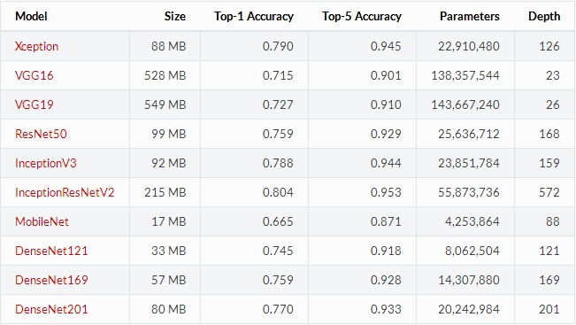
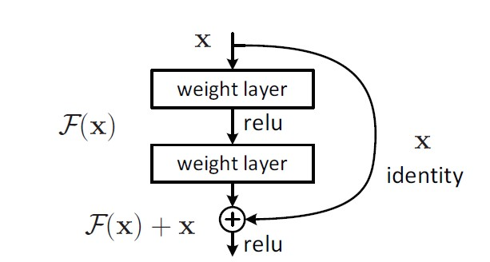
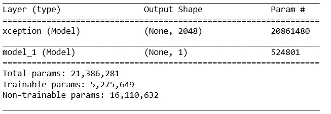
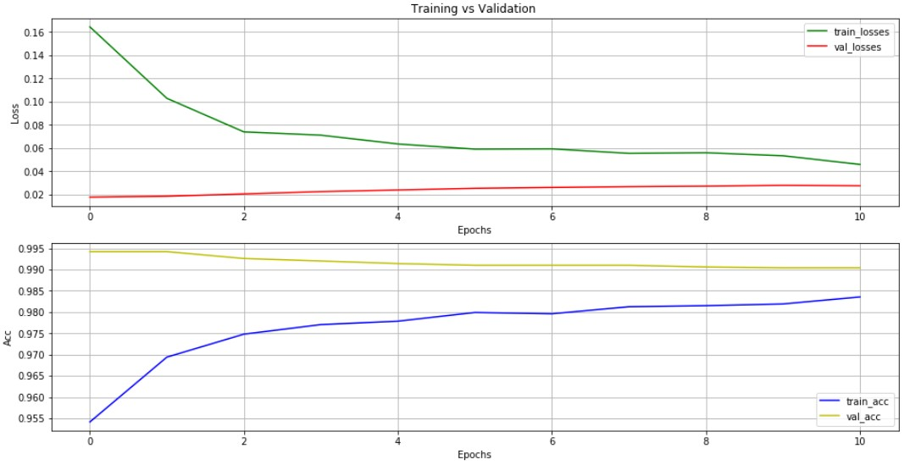
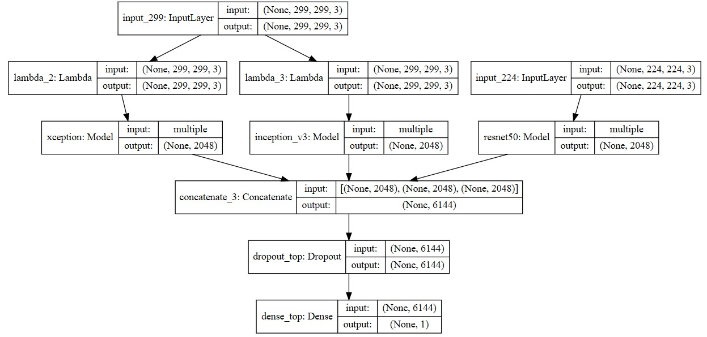

# 猫狗大战

## 项目概览
计算机视觉是使用计算机及其相关设备对生物视觉的一种模拟，让计算机能够感知环境，终极目标是使得计算机能够像人一样“看懂世界”。目前计算机视觉主要用在人脸识别、图像处理、ADAS/无人驾驶、安防监控、智能机器等。

猫狗大战是[Kaggle竞赛](https://www.kaggle.com/c/dogs-vs-cats-redux-kernels-edition)中的一个图像分类项目，从给定的图片集中，区分出是猫还是狗，可以说是计算机视觉中的Hello World 问题。对于人类来说，区分猫和狗是一件非常简单的事情，但是对于计算机来说，我们要怎样写一个程序，让计算机来区别猫还是狗。

## 项目任务

猫狗大战项目的任务是通过深度学习方法识别一张图片是猫还是狗，并预测出是狗的概率（1=狗，0=猫）。在Kaggle竞赛的测试集上，预测出每一张图片是狗的概率，并在Kaggle Public Leaderboard 排名前10%，也就是在Public Leaderboard上的Logloss要低于0.06127.


## 评估指标

该项目属于二分类问题，在Kaggle竞赛上，采用交叉熵损失函数作为评分标准，公式如下，LogLoss值越小，代表模型的性能越好。

$$
LogLoss = - \frac{1}{n} \sum_{i=1}^n{[y_i log(\hat{y_i}) + (1 - \hat{y_i})log (1 - \hat{y_i})]}
$$

其中，

n ： 图片数量

$ \hat{y_i} $ : 模型预测图片为狗的概率

$ y_i $ : 图片的真实标签值，如果图片为狗，则值为1；如果图片为猫，则值为0

log ： 以e为底的对数

## 数据研究

该项目采用Kaggle竞赛提供的数据集，包括训练集和测试集。训练集包括25000张猫和狗的图片，每张图片都有标记是猫还是狗（其中，猫和狗的数量均为12500张），测试集包括12500张没有标记的图片。


观察数据集中的图片，发现大部分图片都比较清晰，图片丰富多样，分辨率也有所不同。图片中的猫和狗的种类多样，姿态各不相同，背景也比较丰富，拍照的角度、光线也各不相同。为了让计算机识别这些图片，需要对数据集进行前期处理。比如需要将数据集分为训练集和验证集，在训练集上训练模型，在验证集上测试一下模型，并根据验证集上的测试结果继续优化模型。由于图片的大小各不相同，在训练模型时，需要将图片的进行统一大小作为模型的输入。

## 算法研究

一般来说，图像分类通过特征学习方法对整个图像进行全部描述，然后使用分类器来判别物体的类别。深度学习方法可以通过有监督的方式学习层次化的特征描述，可以通过卷积神经网络直接将图像像素信息作为输入，最大程度上保留输入图像的所有信息，通过卷积操作进行特征的提取和高层抽象，再通过分类器对图像进行分类，直接输出图像的类别。

该项目可以采用Keras工具，搭建一个深度学习模型，输入端使用一个较小的卷积网络，进行特征提取和抽象，输出端使用Sigmoid函数，进行二分类并输出类别的概率。
也可以采用在大规模数据集上预训练好的模型来提取特征，再通过分类器进行分类。Keras的应用模块Application提供了带有预训练权重的Keras模型，可以直接用来预测、特征提取和微调模型。



在Keras的应用模块Application中，提供以上模型的在ImageNet 的预训练权重，可以使用上述模型作为基础模型。综合评估，可以分别采用Xception、ResNet50、InceptionV3作为基础模型，再在基础模型上做微调。

### 基准模型

针对于图像分类的问题，采用ResNet50 模型作为基准模型。[ResNet](https://arxiv.org/abs/1512.03385)在2015年被提出来，并在ILSVRC 2015比赛中，采用152层网络，将错误率降低至3.57，获得ImageNet classification的冠军。



ResNet引入了残差网络结构（Residual Network），通过残差网络，随着网络的加深，也不降低准确率。


### 方法实施

在[Keras Application](https://keras.io/applications/)中提供了许多预训练模型，这些模型在ImageNet数据集上都获得了比较不错的结果，该项目采用其中的ResNet50模型为基准模型，有关的设计流程可分为：数据预处理，特征提取，模型搭建，模型训练，模型调整，模型预测。

#### 数据预处理

从Kaggle上下载[dogs_vs_cats数据集](https://www.kaggle.com/c/dogs-vs-cats-redux-kernels-edition/data)，根据选取的基本模型的不同（选择Xception、ResNet50、IncptionV3），进行对应的预处理，其中ResNet50的输入大小为224*224图片，而Xception 和InceptionV3是输入大小为299x299，而且将数据放缩至[-1,1]区间。另外，可以对数据集做一系列随机变换进行提升。并将数据集分为train、validation、test三部分，以供模型训练和预测。

```
├── data_gen
    ├── train
    |   ├── cats
    |   |   └── cat.xxx.jpg 
    |   └── dogs
    |       └── dog.xxx.jpg
    ├── validation
    |   ├── cats
    |   |   └── cat.xxx.jpg 
    |   └── dogs
    |       └── dog.xxx.jpg
    └── test
        └── xxx.jpg
```

训练数据预处理：

```python

def pre_process(train_path,data_path,n=1250,ratio=0.2):
    #检查data_path 目录是否存在，如果存在，则删除，重新建立新的目录
    if os.path.exists(data_path):
        shutil.rmtree(data_path,True)
    os.mkdir(data_path)

    for name in ['cats','dogs']:
        os.makedirs('{}/train/{}/'.format(data_path,name))
        os.makedirs('{}/validation/{}/'.format(data_path,name))
    
    #获取文件名，并打乱顺序，为后期随机采样做准备
    filenames = os.listdir(train_path)
    shuffle(filenames)
    
    cat_files = list(filter(lambda x:x[:3] == 'cat', filenames))
    dog_files = list(filter(lambda x:x[:3] == 'dog', filenames))
   
    # m 为训练集的dogs 或者 cats的数量，ratio 为 验证集占数据集n的比例
    m = int(n*(1-ratio)) /2 
   
    for i in tqdm(range(int(n/2))):
        if i < m :
            shutil.copyfile('{}/{}'.format(train_path,cat_files[i]),'{}/train/cats/{}'.format(data_path,cat_files[i]))
            shutil.copyfile('{}/{}'.format(train_path,dog_files[i]),'{}/train/dogs/{}'.format(data_path,dog_files[i]))
        else:
            shutil.copyfile('{}/{}'.format(train_path,cat_files[i]),'{}/validation/cats/{}'.format(data_path,cat_files[i]))
            shutil.copyfile('{}/{}'.format(train_path,dog_files[i]),'{}/validation/dogs/{}'.format(data_path,dog_files[i]))


```

#### 特征提取

采用ResNet50作为基准模型，在Keras Application中提其在ImageNet上的预训练权重，可以直接利用ResNet50的模型以及权重。在载入ResNet50的预训练模型权重时，需要保留其卷积层的权重，不可训练，为了避免训练时的重复计算，节约训练时间，通过predict进行特征提取并保存，作为后续模型的输入。

```python

def gap_pred(MODEL, image_size, pool=None,lambda_func=None):
    width = image_size[0]
    height = image_size[1]
    input_tensor = Input((height, width, 3))
    x = input_tensor
    
    # 根据不同的模型，进行数据预处理
    if lambda_func:
        x = Lambda(lambda_func)(x)
        
    #导入预训练模型，并导入权重   
    model = MODEL(input_tensor=x, weights='imagenet', include_top=False,pooling = pool)

    #通过generator生成数据
    image_gen = ImageDataGenerator()
    train_gen = image_gen.flow_from_directory("data_gen/train", image_size, shuffle=False, batch_size=32)
    valid_gen = image_gen.flow_from_directory('data_gen/validation',image_size,shuffle = False,batch_size = 32)
    test_gen  = image_gen.flow_from_directory("test_gen", image_size, shuffle=False, batch_size=32, class_mode=None)

    #通过predict 导出特征向量
    train = model.predict_generator(train_gen)
    valid = model.predict_generator(valid_gen)
    test = model.predict_generator(test_gen)
    
    #将特征向量保存为h5文件
    with h5py.File("gap_pred_%s.h5"%model.name) as h:
        h.create_dataset("train", data=train)
        h.create_dataset("valid",data=valid)
        h.create_dataset("test", data=test)

        h.create_dataset("train_label", data=train_gen.classes)
        h.create_dataset("valid_label",data = valid_gen.classes)
```

#### 模型搭建

在ResNet50网络的后端，增加一个Dense层，输出大小为(None,1)，并通过Sigmoid函数作为模型的输出。先从导入数据预处理时通过predict导出的ResNet50的特征向量，并作为后端模型的输入。

```python
import numpy as np
import h5py

X_train = []
X_valid = []
X_test = []

# 导入数据预处理的特征
model_name = ["gap_pred_resnet50.h5"]
for filename in model_name:
    with h5py.File(filename, 'r') as h:
        X_train.append(np.array(h['train']))
        X_test.append(np.array(h['test']))
        X_valid.append(np.array(h['valid']))
        y_train = np.array(h['train_label'])
        y_valid = np.array(h['valid_label'])
    
        
X_train = np.concatenate(X_train, axis=1)
X_valid = np.concatenate(X_valid,axis = 1)
X_test = np.concatenate(X_test, axis=1)
```

模型的输入采用ResNet50模型（不包括Top层，并添加GlobalAveragePooling2D池化）导出来的特征向量作为输入，模型采用binary_crossentropy作为损失函数，以adadelta作为优化器。

```python

from keras.models import Model
from keras.layers import Input,Dropout,Dense,Flatten

np.random.seed(2018)

#搭建模型Top层
input_tensor = Input(X_train.shape[1:])
x = Dense(1, activation='sigmoid')(input_tensor)
model = Model(input_tensor, x)

model.compile(optimizer='adadelta',
              loss='binary_crossentropy',
              metrics=['accuracy'])

```


#### 模型训练

将模型ResNet50提取的特征向量，作为模型top_model的输入，并设置训练集和验证集，训练模型，并进行预测。为获取训练过程中的训练集上的误差和验证集上的误差，以及训练集上的精度和验证集上的精度，在每一个epoch结束时调用Callback函数，获取误差和精度的值。另外，为了防止过度训练，采用EarlyStop回调函数，监控验证集上的精度，当连续10个epoch验证集上的精度都没有增加时，停止训练。

```python
from PIL import Image
from keras.preprocessing import image
from keras.callbacks import Callback,EarlyStopping

#回调函数，获取loss和acc
class LossHistory(Callback):
    def on_train_begin(self,log={}):
        self.losses = []
        self.val_losses = []
        self.acc = []
        self.val_acc = []
    def on_epoch_end(self,batch,logs={}):
        self.losses.append(logs.get('loss'))
        self.val_losses.append(logs.get('val_loss'))
        self.acc.append(logs.get('acc'))
        self.val_acc.append(logs.get('val_acc'))

history = LossHistory()

#早停机制，监控验证集上的精度Acc
earlystop = EarlyStopping(monitor='val_acc',patience =10,verbose=1,mode = 'max')
#Validation Data
valid_data = (X_valid,y_valid)
#训练模型
model.fit(X_train, y_train, batch_size=128, epochs=50,validation_data=valid_data,callbacks = [history,earlystop])

```


从训练过程中的误差和精度曲线看出来，训练集上的误差大概在0.02，精度大概在0.98左右，验证集上的误差大概在0.06左右，精度在0.97左右。并将训练好的模型保存为h5文件，方便做预测时导入。

#### 模型预测

将训练好的模型导入，并在测试集上预测。最终，生成Kaggle提交结果的格式，并查看Public Leaderboard上的Logloss分数为0.07661.

```python

#导入测试数据
filename = 'gap_pred_resnet50.h5'
with h5py.File(filename, 'r') as h:
    X_test =np.array(h['test'])

#导入模型
model = model_from_json(open("./models/model_string_ResNet50.json",'r').read())
model.load_weights('./models/model_weights_ResNet50.h5')


#模型预测，并对输出预测进行限值
y_pred = model.predict(X_test, verbose=1)
y_pred = y_pred.clip(min=0.005, max=0.995)

```

### 模型Fine-tune

从ResNet50模型的预测结果来看，并没有达到预期的基准阈值。为了获得更好结果，可以采用微调模型。因为基础模型的底部网络能够很好的提取图片的特征，而顶部的网络大部分是用于分类，故保持基础模型`base_model`的底部网络权重，而释放基础模型`base_model`的顶部网络权重，加载已经训练好的`top_model`的权重，重新在训练集上训练模型。

#### 模型搭建

有关`base_model`模型，采用Xception模型（不包含Top层，采用GlobalAveragePooling2D池化层）,重构Top Model.

```python
from keras.models import Model
from keras.layers import Dense ,Dropout,Input

#构建Top_model
input_tensor = Input(X_train.shape[1:])
layer = input_tensor
layer = Dropout(0.5)(layer)
layer = Dense(256,activation = 'relu')(layer)
layer = Dropout(0.5)(layer)
layer = Dense(1,activation = 'sigmoid')(layer)

model = Model(input_tensor,layer)

model.compile(optimizer = 'adadelta',
             loss = 'binary_crossentropy',
             metrics = ['accuracy'])

```

#### 模型训练

为了提高模型训练的效率，直接用之前Xception模型提取的特征向量作为模型的输入，避免每次训练时都计算一次。同样，在训练模型时，监控每个epoch的误差和精度，并设置早停机制，最后保存top_model模型以及权重。


从图中可以看出来，top_model模型在训练集上误差在0.015左右，精度为0.995左右；在验证集上误差为0.017左右，精度为0.994左右。最终，在Kaggle的得分为0.04325，可以满足基准阈值。

#### 模型微调

为了进一步优化模型，可以对Xception模型的参数微调，冻结底部部分卷积层参数，微调顶部的部分网络参数。具体的步骤如下：

* 搭建Xception模型，并载入预训练的权重
* 载入上述预训练好的top_model模型，以及载入权重
* 冻结Xception模型的部分参数
* 在数据集上重新训练模型

```python
#Xception模型输入数据预处理
x = Input((299,299,3))
x = Lambda(preprocess_input)(x)

image_size = (299,299)

#导入预训练Xception模型，并采用GlobalAveragePooling2D池化
base_model = Xception(input_tensor = x,weights = 'imagenet',include_top = False,pooling = 'avg')

#搭建top_model层
input_tensor = Input(base_model.output_shape[1:])

layer = Dropout(0.5)(input_tensor)
layer = Dense(256,activation = 'relu')(layer)
layer = Dropout(0.5)(layer)
layer = Dense(1,activation = 'sigmoid')(layer)

top_model = Model(input_tensor,layer)

#导入top_model预训练权重
top_model.load_weights('./models/model_weights_xception_top.h5')

```

冻结一部分Xception模型的参数，并采用SGD方法，以比较低的学习率来更新模型参数。

```python
from keras.optimizers import SGD

#冻结Xception模型的部分参数
for layer in base_model.layers[:125]:
    layer.trainable = False
for layer in base_model.layers[125:]:
    layer.trainable = True

model = Sequential()
model.add(base_model)
model.add(top_model)

#采用SGD方法进行优化
model.compile(optimizer = SGD(lr = 0.0001,momentum = 0.9),loss = 'binary_crossentropy',metrics = ['accuracy'])

```

主要是因为Xception模型和top_model 模型之前都已经训练好了，如果采用自适应学习率来更新时，之前训练好的权重会因为较大的梯度，而会破坏网络结构。



在数据集上，重新训练模型，监控每一个epoch的误差与精度曲线，在Kaggle的得分为0.04891，可以满足基准阈值。



### 模型融合

以上的两种方法均是基于单个模型（ResNet50 或者Xception）的训练以及预测，而且在测试集上的表现都不错。可以将两个模型甚至更多模型模融合在一起，结合各个模型对图像提取的特征，再进行分类。选取ResNet50、Xception、InceptionV3三个模型进行融合，再搭建一个小的分类器进行分类。从Keras Application模块中导入的预训练权重（不包含Top层，GlobalAveragePooling2D作为输出），三个模型的输出大小均为（None，2048）。



训练模型，最终有关融合模型在测试集上的Kaggle上的得分为0.04014，超过了当初设定的基准阈值0.06127.

## 总结

有关上诉三种模型的对比如下表所示，分别对比了模型的层数，参数数量以及在Kaggle竞赛上的得分情况。

|模型 |层数|参数数量|Kaggle 得分(LogLoss)|
|--|--|--|:--:|
|ResNet50  |  176 | 23589761  |  0.07661 |
|Xception_top |  137 | 21386281  |  0.04325 |
|Xception_top_finetune | 137 | 21386281 |  0.04891 |
|ResNet50_Xception_InceptionV3 | 312 | 132374162 |  0.04014 |

从上对比表中对比可以看出，`Xception_top` 和 `Xception_top_finetune` 模型对比，两者的模型架构一样，只是前者采用了Xception在ImgNet数据上的预训练参数，而后者在采用前者的模型架构，但是释放了Xception的后部分参数，重新在`dogs_vs_cats`数据集上训练，结合`Traning vs Validation`来看，在训练时，在验证集上的精度一直在下降，误差一直在上升，而在训练集上，精度一直在提升，误差一直在下降，有比较明显的过拟合的现象。
从上述的对比来看，在图像分类领域，比较好的一种方式是采用预训练模型的方式，而且可以结合多个模型的特性，再进行分类效果会更好。在训练模型时，也出现了过拟合的现象，下一步的改进方法可以如下：

* 将验证集的数据集全部拿来训练，直接在测试集上测试；
* 在进行数据预处理时，对图像做提升（翻转、加噪声等）
* 使用更强力的dropout
* 使用正则项


## 参考文献

[1] Francois Chollet.Building powerful image classification models using very little data[EB/OL].https://blog.keras.io/building-powerful-image-classification-models-using-very-little-data.html, 2016-06-05

[2] Kaiming He, Xiangyu Zhang, Shaoqing Ren, Jian Sun. Deep Residual Learning for Image Recognition[EB/OL]. arXiv:1512.03385

[3] François Chollet. Xception: Deep Learning with Depthwise Separable Convolutions[EB/OL]. arXiv:1610.02357.

[4] Karen Simonyan, Andrew Zisserman. Very Deep Convolutional Networks for Large-Scale Image Recognition[EB/OL]. arXiv:1409.1556.

[5] Christian Szegedy, Vincent Vanhoucke, Sergey Ioffe, Jonathon Shlens, Zbigniew Wojna. Rethinking the Inception Architecture for Computer Vision[EB/OL]. arXiv:1512.00567 .

[6] Christian Szegedy, Sergey Ioffe, Vincent Vanhoucke, Alex Alemi. Inception-v4, Inception-ResNet and the Impact of Residual Connections on Learning[EB/OL]. arXiv:1602.07261.

[7] Alex Krizhevsky, Ilya Sutskever, Geoffrey E.Hinton. ImageNet Classification with Deep Convolutional Neural Networks[EB/OL]. https://www.nvidia.cn/content/tesla/pdf/machine-learning/imagenet-classification-with-deep-convolutional-nn.pdf.
